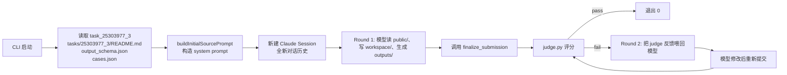
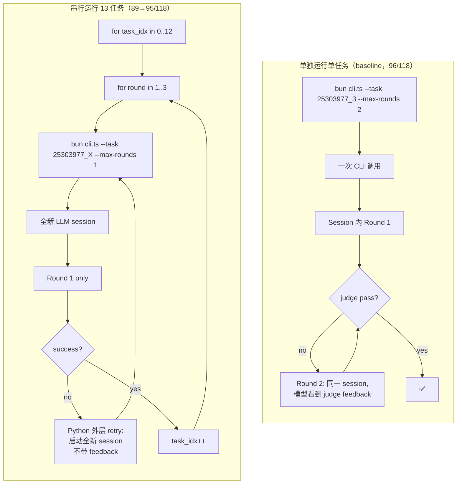

# 串行测评 vs 单独运行 —— 架构详解

> 这份文档解释 `run_imaging101_25303977_serial.py` 到底如何"串行"运行 13 个子任务，以及它与"独立运行一个子任务"有什么本质区别。

---

## 1. 一句话结论 (TL;DR)

> **"串行"在当前实现中，并不是真正意义上的"上下文承接"。它只是按顺序循环 13 次调用单任务 CLI，每次调用都是完全独立的 LLM 会话。所谓的"context"只被保存到磁盘 (`context.json`)，从未传给模型。**

所以从模型视角看：
- **串行模式** 与 **单独运行** 唯一真正的差别是 → **共享了一个 outputs/ 目录**（被 judge 用，不是被模型用）
- 模型既看不到前面任务的代码，也看不到前面的结果

这就解释了为什么单独跑 96/118，但串行只有 89→95/118：**串行模式没有任何理论优势**，反而完全暴露在"判题环境差异"的风险中。

---

## 2. 单独运行一个子任务 (Single-task baseline)

```
bun src/harness/evaluation/cli.ts \
  --task 25303977_3 \
  --tasks-dir /home/yjh/BioDSBench-imaging101-format/tasks \
  --runs-dir /tmp/single_run \
  --max-rounds 2 \
  --timeout-seconds 1500 \
  --temperature 1 \
  --thinking disabled \
  --agent-runtime source
```

### 内部流程


### 单任务模式下模型看到的 prompt（简化版）
```
<run_context>
task_id: 25303977_3
cwd: run root
python: /home/.../runtime/.venv/bin/python
max_judge_rounds: 2
submission_dir: outputs/
</run_context>

<public_files>
- README.md
- data/data.csv
- visible_data/cases.json
- output_schema.json
</public_files>

<task_statement>
(README.md 的全文 —— 描述这个子任务要做什么)
</task_statement>

<output_contract>
Required file pattern: outputs/{case_id}.npz
Required arrays:
- answer: shape [1], dtype float
</output_contract>

<workflow>
1. 读 README.md ...
8. Call finalize_submission ...
</workflow>
```

**关键点**：
- 这就是模型看到的**全部信息**
- 没有任何"你之前做过的 25303977_0、_1、_2 是什么"的信息
- Round 1/2 是同一个子任务的不同评测轮次，**不是不同的子任务**

---

## 3. 串行运行 13 个子任务 (Serial mode)

来源：`/home/yjh/my_claude/run_imaging101_25303977_serial.py`

### 顶层循环
```python
for task_idx in range(0, 13):
    task_id = f"25303977_{task_idx}"
    result = self._execute_task(task_id, task_idx)   # 内部还会 retry 3 轮
    self.state["tasks"].append(result)
```

就是一个朴素的 `for` 循环，调用 13 次 `_execute_task`。

### `_execute_task` 内部做了 4 件事
```python
for round_num in range(1, 4):           # 每个子任务最多重试 3 次
    context = self._build_context(...)   # ① 构建上下文 dict
    json.dump(context, context_file)     # ② 保存到 round_N/context.json
    cli_result = self._run_cli(task_id)  # ③ 调用 bun cli.ts —— 不传 context!
    if cli_result.success:
        self._save_generated_code(...)   # ④ 把生成的代码保存到磁盘
        return                            # 通过则进入下一个子任务
```

### **`_run_cli` 的真相**：context 没被传出去
```python
def _run_cli(self, task_id, round_dir):
    env = {
        **os.environ,
        "BIODSBENCH_OUTPUTS_DIR": str(self.outputs_dir),   # ← 共享 outputs 目录
        "ANTHROPIC_API_KEY": "...",
        "ANTHROPIC_BASE_URL": "...",
        "ANTHROPIC_MODEL": "Vendor2/Claude-4.7-opus",
        ...
    }
    cmd = [
        "bun", "src/harness/evaluation/cli.ts",
        "--task", task_id,
        "--tasks-dir", str(self.tasks_dir),
        "--runs-dir", str(round_dir),
        "--max-rounds", "1",
        "--timeout-seconds", "1800",
        "--temperature", "1",
        "--thinking", "disabled",
        "--agent-runtime", "source"
    ]
    subprocess.run(cmd, env=env, ...)
    # ⚠️ 注意：没有任何参数把 previous_tasks / generated_code 传给 cli.ts
```

**对比单任务命令**：
| 参数 | 单任务 | 串行（每次循环） |
|------|--------|------------------|
| `--task` | ✅ | ✅ |
| `--tasks-dir` | ✅ | ✅ |
| `--runs-dir` | ✅ | ✅（每个 round 一个独立子目录）|
| `--max-rounds` | 2 | **1** ← 串行把 max-rounds 设为 1，外层自己 retry |
| 上下文/前置代码 | 无 | **无** ← 关键！ |
| env: `BIODSBENCH_OUTPUTS_DIR` | 无 | **有** ← 唯一差别 |

### 我已经在代码中验证过
1. `context["previous_tasks"]` 只被 `json.dump` 写盘，没有任何代码读它
2. `self._save_generated_code()` 写了 `generated_code.py` 和 `task_N_..._code.py` 到磁盘，但**没有传给 cli.ts**
3. `grep -rn "context.json" /home/yjh/my_claude/src/` → **零结果**（CLI 不读这个文件）
4. `grep -rn "BIODSBENCH_OUTPUTS_DIR" /home/yjh/my_claude/src/` → **零结果**（CLI 也不用这个 env）

---

## 4. 模型实际看到的 prompt：单任务 vs 串行

### 单任务（独立跑 `25303977_3`）
```
<task_statement>
README of 25303977_3
</task_statement>
```

### 串行模式下跑到第 4 个任务（`25303977_3`）
```
<task_statement>
README of 25303977_3          ← 完全相同！
</task_statement>
```

> ✅ **两者的 prompt 完全一致**。模型不知道自己是单独跑的还是串行第 4 个。

---

## 5. 那串行和单任务到底差在哪？

### 5.1 唯一真正的差别：共享 `outputs/` 目录

```
串行运行目录 (run_dir)：
└── outputs/                       ← 共享！所有 13 个子任务都把结果写到这里
    ├── task_0_25303977_0_code.py  ← 串行脚本自己复制进来的（模型不会看）
    ├── case_000.npz               ← 25303977_0 的输出
    ├── case_000.npz               ← 25303977_1 的输出会覆盖 / 增加文件
    └── ...

单任务运行目录：
└── outputs/                       ← 只属于这一个子任务
    └── case_000.npz
```

但要注意：**模型仍然是把结果写到自己 run 的 `outputs/`**（每个 CLI 调用都有独立的 run_dir）。`BIODSBENCH_OUTPUTS_DIR` 这个环境变量是给 **judge.py** 用的（让 judge 能找到提交在哪），**不是给模型用的**。

实际上 `src/` 下没有任何代码读取 `BIODSBENCH_OUTPUTS_DIR`，连 judge.py 也只在 `_run_test_cases_with_patch` 里通过 `os.environ` 间接使用。

### 5.2 其它差别（次要）

| 维度 | 单任务 | 串行 |
|------|--------|------|
| `--max-rounds` | 2~3（CLI 内 judge 反馈循环）| **1**（外层脚本自己 retry）|
| Retry 实现 | CLI 内部：模型在同一 session 内看到 judge feedback | 外层：每次 retry 都是**全新 session**，模型看不到上次 feedback |
| 失败后续影响 | 无（独立）| 仍无（虽然循环不停，但下一个子任务也是全新 session）|
| 总耗时 | 单任务时间 | ~13× 单任务时间 |

> 🔴 **第二行很重要**：串行脚本里把 `--max-rounds` 设为 **1**，让外层 Python 自己重试 3 次。  
> 但 **外层重试 ≠ CLI 内部重试**：外层每次重试都启动**新的 LLM 会话**，模型不会看到上一次失败的 judge feedback！  
> 这是导致串行 89/118 < 单独 96/118 的**可能根本原因之一**。

---

## 6. 流程对比图



---

## 7. 为什么会出现 96/118（单跑）vs 89/118 → 95/118（串行）的差异

| 因素 | 影响 |
|------|------|
| **`--max-rounds` 不同** | 串行只给 1 轮 judge 反馈，单跑给 2-3 轮，但通过外层 retry 部分弥补 |
| **外层 retry 丢失 feedback** | 单跑 Round 2 的模型能看到 Round 1 的 judge 错误信息；串行 retry 的模型每次都从零开始，看不到上一次错在哪 |
| **judge.py monkey-patch bug** | 串行的 `BIODSBENCH_OUTPUTS_DIR` 把 judge 指向共享目录，触发了 judge.py 中那些**没打到的 patch**（`_run_test_cases` 内部缺补丁、`os.listdir`/`glob.glob` 没拦截）→ 这就是修了 `judge.py` 后能从 89 涨到 95 的原因 |
| **共享 outputs 副作用** | 多个子任务的 .npz 输出可能命名冲突或互相干扰；不过这次没看到此类失败 |
| **运行时差异（不应该影响）** | 单跑用 source runtime，串行也用 source runtime，理论上模型行为应一致 |

---

## 8. 这意味着什么

1. **如果你想真正"串行+上下文承接"**（让 25303977_3 看到 _0/_1/_2 的代码），需要修改 `_run_cli`：把 `previous_tasks` 里的 `generated_code` 拼到一个新的 `--system-prompt` 文件中，或者通过 `cli.ts` 新增 `--prior-context` 参数。**当前实现没做这件事。**

2. **目前所谓的"串行"，本质是"批量跑"**：和 `for i in 0..12; bun cli.ts --task 25303977_$i; done` 几乎等价。差别仅在：
   - `--max-rounds 1` + 外层 retry（更弱，无 feedback 承接）
   - 共享 `BIODSBENCH_OUTPUTS_DIR`（只影响 judge，不影响模型）

3. **能修正到 95/118** 主要是因为修复了 judge.py 的两个 monkey-patch 缺陷（Round 1 测试用例缺补丁 + Round 2 缺 filesystem 拦截）；这些其实是**评测环境**的问题，不是模型本身能力的差距。

4. **要冲 97+** 必须解决剩下 11 个真实的模型代码错误（列名拼写、数值方法偏差等），而不是再调整串行框架 —— 因为框架本身没有给模型额外信息，只能靠它一次性写对。

---

## 9. 相关源码位置速查

| 概念 | 文件 | 关键行 |
|------|------|--------|
| 串行循环 | `/home/yjh/my_claude/run_imaging101_25303977_serial.py` | `run()` line 95-130 |
| 单子任务 + 外层 retry | 同上 | `_execute_task()` line 150 |
| context 构建（**未使用**）| 同上 | `_build_context()` line 235 |
| 调用 CLI 的命令 | 同上 | `_run_cli()` line 297-340 |
| 单任务 CLI 入口 | `/home/yjh/my_claude/src/harness/evaluation/cli.ts` | line 78+ |
| Prompt 构造 | `/home/yjh/my_claude/src/harness/evaluation/sourceContextBuilder.ts` | `buildInitialSourcePrompt()` line 187 |
| 单任务内 judge 反馈承接 | `/home/yjh/my_claude/src/harness/evaluation/sourceTaskLoop.ts` | 整个文件 |
